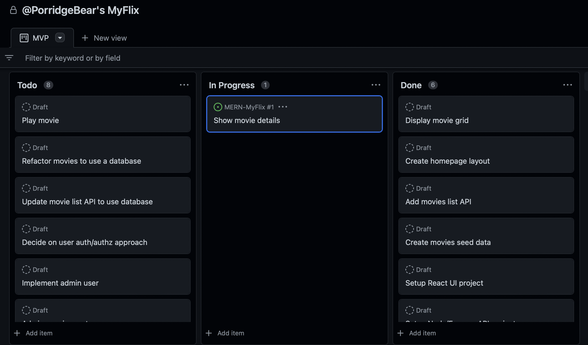
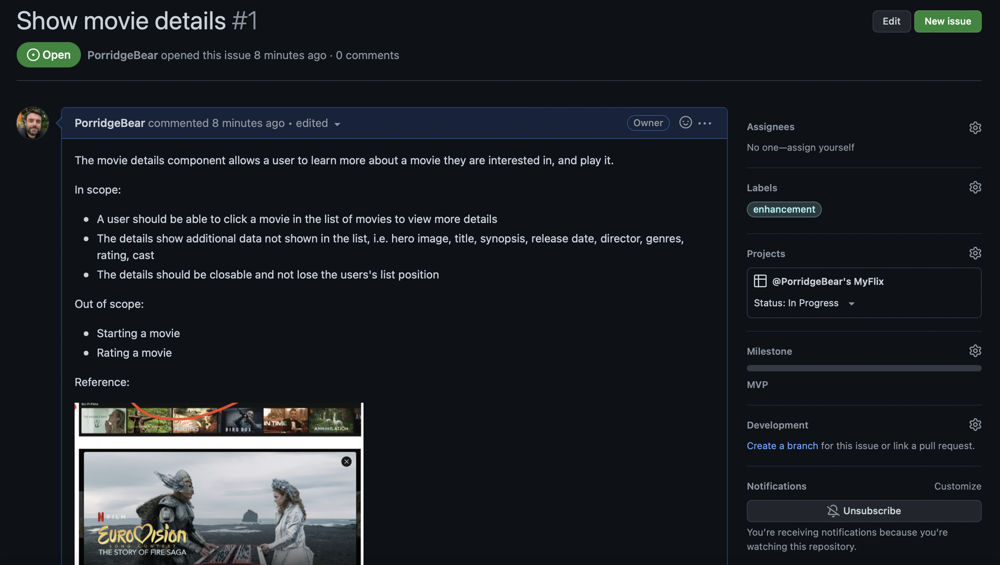

# MERN MyFlix

I've used this project as a dual-pronged refresher and learning project for the popular MERN technology stack.

Netflix is my feature set inspiration as it covers a broad range of common requirements found in web applications:

* Responsive, reactive UI
* Content navigation, filtering, searching
* User authentication and authorisation
* Account management
* Admin CRUD
* Data storage
* Caching
* Media handling (upload, streaming, thumbnailing) and CDN usage

# Other READMEs

* [API](api/README.md)
* [UI](ui/README.md)
* [Data](data/README.md)

# Architecture

The project employs API-driven frontend architecture.

* Frontend: React single page app (SPA); for users of MyFlix, including an "admin" context that will enable CRUD
* API: Node/Express; provisioning features via API for the frontend

Since the project is in the first instance to refresh/learn some MERN, I have avoided microservice architecture, though a fork of this project to break the monolithic API into services may be a nice follow-on project.

# Approach

I'll start out with a Miro board and get a sense of what the user journey and features that I want to support will be and also the data that underpins the service. I'll use a couple of methods for pulling these together; story mapping and data modelling.

## Story mapping

The story map is a nice way to think of the system from the user journey perspective in varying degrees of abstraction. It is then possible to take a horizontal slice through this map to create releases.

## Data modelling

I like to think about the data model early on, and will create a rough entity relationship diagram (ERD) for what I think will underpin all features.

## Tracking work

I'll then get into a rhythm of implementing deliverable iterations following the story map release slices.

I've used a private Github project board to track my progress:

I realised after having implemented the movies list functionality that the board supports pairing cards to Github project issues which I felt would be better aligned to professional development, where an issue can be described and labeled, given a milestone, and made into a pull request for review if needed. Whilst the project is only personal, it's good to practice these organisational practices, too.

# Story Map

I created a Miro board and pulled in some screen captures of the Netflix films area which will form the basis of my  feature set.

There's a handy built-in story map template to get going:

# Data Model

# Progress

## 07/07/22: initial movie grid and movie grid cell component

I ended up using Bootstrap 5 and React Bootstrap to neatly use Bootstrap within the JSX. The grid here supports different numbers of movie cells per row depending on device, e.g. on mobile just 2 per row.

## 08/07/22: initial movie details modal

A few challenges to solve for here:

* Selecting a movie - when to show the modal and when to close it. The current movie selection I decided belonged most naturally to the grid component, and I use the approach of passing callback functions to components to allow e.g. for each movie cell to notify the parent grid that it has become the selected movie
* The posters are all portrait which does not work super well as a lot of horizontal scrolling is needed. For now I chose to crop the portrait image in the modal to appear landscape, but I think I will need to find an alternate source of posters

## 12/07/22: initial movie details modal

* Needed to implement a new spider against a new data source to provide for cast
* Now displays multiple directors, cast members, genres all as lists for now and rating which is unable to be scraped at present so I have used a randomising function in the spider to provide a random rating for now

